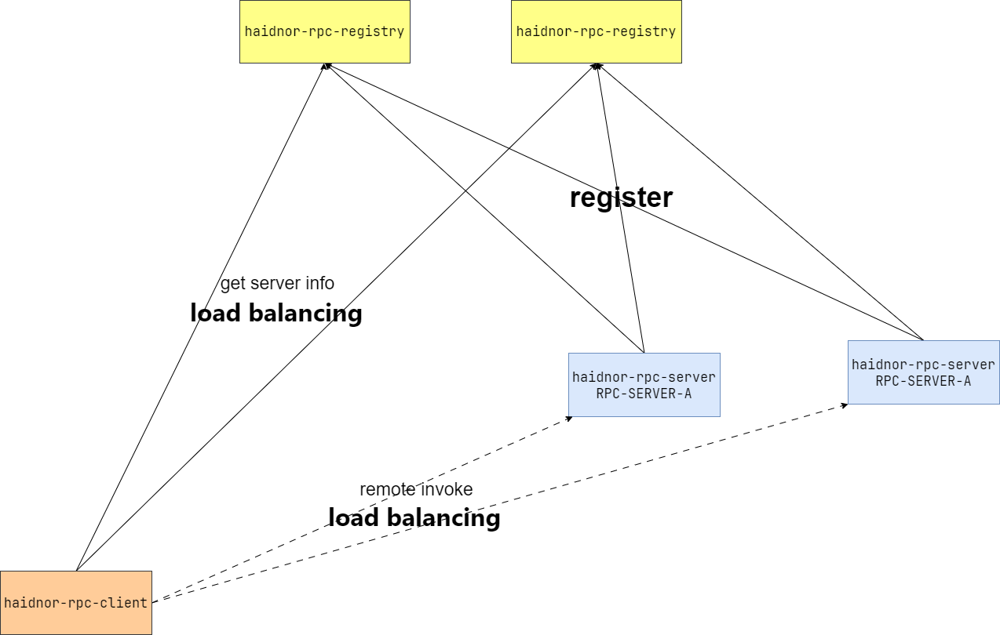

# haidnor-rpc
Java RPC (Remote Procedure Call) 框架。由服务发现注册中心、客户端、服务端三个模块组成。快速集成于 SpringBoot 3.X 项目，配置使用简单，提供跨服务远程调用能力。

# 架构
  
**haidnor-rpc-registry**  
服务注册中心。可独立运行的模块。独立模块，单独部署运行。

**haidnor-rpc-server**    
远程调用服务端。集成于 SpringBoot 项目运行。

**haidnor-rpc-client**  
远程调用客户端。集成于 SpringBoot 项目运行。

haidnor-rpc 与大多数 RPC 框架的工作原理类似。服务端启动后主动向注册中心
注册自身服务信息。客户端定时向注册中心拉取所有已注册的服务信息，根据服务列表信息进行负载均衡远程调用。

# 环境说明
haidnor-rpc 基于 Java 17，SpringBoot 3.X 开发。  
haidnor-rpc 使用 [haidnor-netty4-remoting](https://github.com/FranzHaidnor/haidnor-netty4-remoting) 作为网络通讯的组件。在使用前请务将 haidnor-netty4-remoting 到本地 maven 仓库。

# 快速使用
# 注册中心 haidnor-rpc-registry
修改注册中心配置文件 `haidnor-rpc-registry/src/main/resources/application.yml`
```yaml
rpc:
  registry:
    port: 8090 # 注册中心服务端口号
```  
在 IDE 中运行 `haidnor-rpc-registry/src/main/java/haidnor/rpc/registry/RegistryApplication.java` 注册中心启动类即可。  
也可以将 haidnor-rpc-registry 单独打包后部署运行。

# RPC 服务端 haidnor-rpc-server
将 haidnor-rpc-server 模块使用 maven 命令安装到本地仓库。  
创建 SpringBoot3.X 项目，并配置 pom.xml 文件，引入以下 dependency 配置。
```xml
<dependency>
    <groupId>haidnor</groupId>
    <artifactId>haidnor-rpc-server</artifactId>
    <version>1.0</version>
</dependency>
```
修改项目 .yaml 配置文件
```yaml
spring:
  application:
    name: RPC-Server # 服务名称

rpc:
  registry:
    address: 127.0.0.1:8090 # 注册中心访问地址
  server:
    port: 8080 # 本地服务端端口号
```
编写提供可被远程调用的接口,与实现类
```java
package test.service;

public interface StudentService {

    int getAge(Long studentId);

}
```
```java
package test.service.impl;

import haidnor.rpc.server.annotation.RpcService;
import test.service.StudentService;

@RpcService
public class StudentServiceImpl implements StudentService {
    @Override
    public int getAge(Long studentId) {
        if (studentId == 1) {
            return 18;
        }
        return -1;
    }
}
```
注意，提供远程调用服务的接口实现类需要添加 `@RpcService` 注解。  
之后启动 SpringBoot 项目即可。以上用例在 haidnor-rpc-server 模块下的单元测试中所有体现，你可以在 IDE 中直接运行测试。

# RPC 客户端 haidnor-rpc-client
将 haidnor-rpc-client 模块使用 maven 命令安装到本地仓库。  
创建 SpringBoot3.X 项目，并配置 pom.xml 文件，引入以下 dependency 配置。
```xml
<dependency>
    <groupId>haidnor</groupId>
    <artifactId>haidnor-rpc-client</artifactId>
    <version>1.0</version>
</dependency>
```
修改项目 .yaml 配置文件
```yaml
rpc:
  registry:
    address: 127.0.0.1:8090  #  注册中心访问地址
  client:
    requestTimeoutMillis: 1000  # 远程调用请求超时时间。单位：毫秒
```
将服务端中提供远程调用的接口代码文件复制到客户端项目中。**要求包路径完全一致! 通常远程调用的接口是应该编写在一个公用的模块当中，同时被服务端与客户端引用。**  
```java
package test.service;

import haidnor.rpc.client.annotation.RpcInterface;

@RpcInterface(serverName = "RPC-Server")
public interface StudentService {

    int getAge(Long studentId);

}
```
在客户端中需要将远程服务的接口添加注解 `@RpcInterface`, 其 `serverName` 属性是提供远程调用服务端名称。  

在客户端 SpringBoot 启动类上添加注解 `@EnableRpcClient`, 其 `basePackages` 属性是存放远程调用接口的父包。haidnor-client 启动后会扫描 basePackages 包下所有含有 `@RpcInterface` 注解标记接口，并为其创建 Spring 代理对象。
```java
import haidnor.rpc.client.annotation.EnableRpcClient;
import org.springframework.boot.SpringApplication;
import org.springframework.boot.autoconfigure.SpringBootApplication;

@SpringBootApplication
@EnableRpcClient(basePackages = {"test.service"})
public class ClientApplication {

    public static void main(String[] args) {
        SpringApplication.run(ClientApplication.class, args);
    }

}
```
使用远程调用接口
```java
import org.springframework.beans.factory.annotation.Autowired;
import org.springframework.web.bind.annotation.RequestMapping;
import org.springframework.web.bind.annotation.RestController;
import test.service.StudentService;

@RestController
@RequestMapping("/test")
public class TestController {

    @Autowired
    private StudentService studentService;

    @RequestMapping("/getAge")
    public String test() {
        int age = studentService.getAge(1L);
        return String.valueOf(age);
    }
}
```

# 框架机制说明
**1. 注册中心服务端心跳检测机制**  
注册中心会定时检测服务端的连接，若服务端在 60 秒内无任何读写事件，将会自动将服务信息剔除。

**2.RPC 服务端注册与重连**  
服务端启动后会自动向注册中心注册自身服务信息，若连接失败将自动在 5 秒后重试连接注册。  
服务端每 30 秒向注册中心发送一次心跳检测，若发送心跳失败将会在 5 秒后重新触发注册连接机制。

**3.RPC 客户端定时拉取服务信息**  
客户端启动后自动每间隔 10 秒向注册中心发送请求，获取所有已注册的服务信息。

**4.RPC 客户端对服务端的连接管理策略**  
客户端对于服务端的连接是懒加载的，只有在第一次远程调用的时候才会创建连接通道。客户端每间隔 10 秒会向 10 秒内无任何读写事件的服务端发送一次心跳检测。若发送心跳失败，将会直接关闭与服务端的连接。


